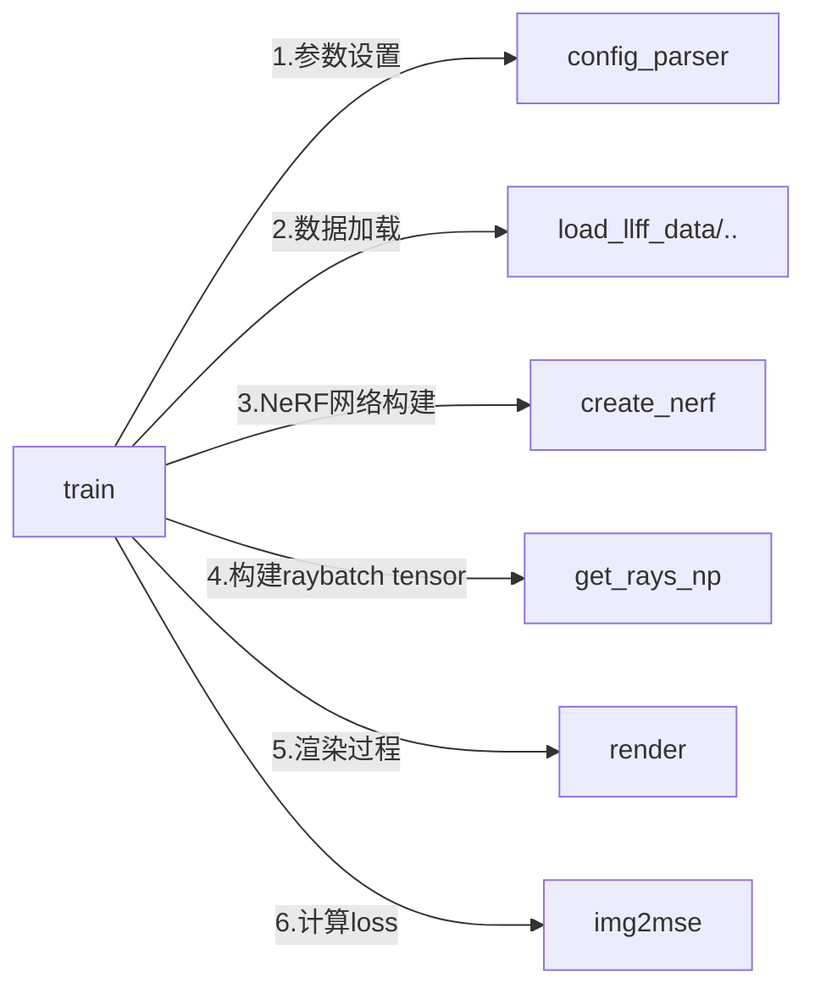
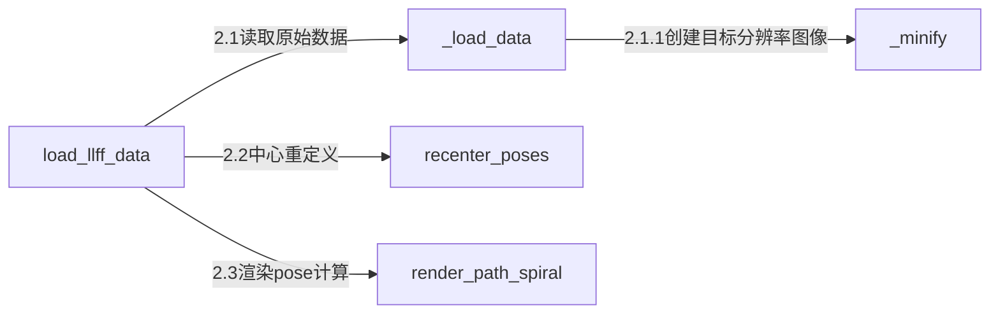
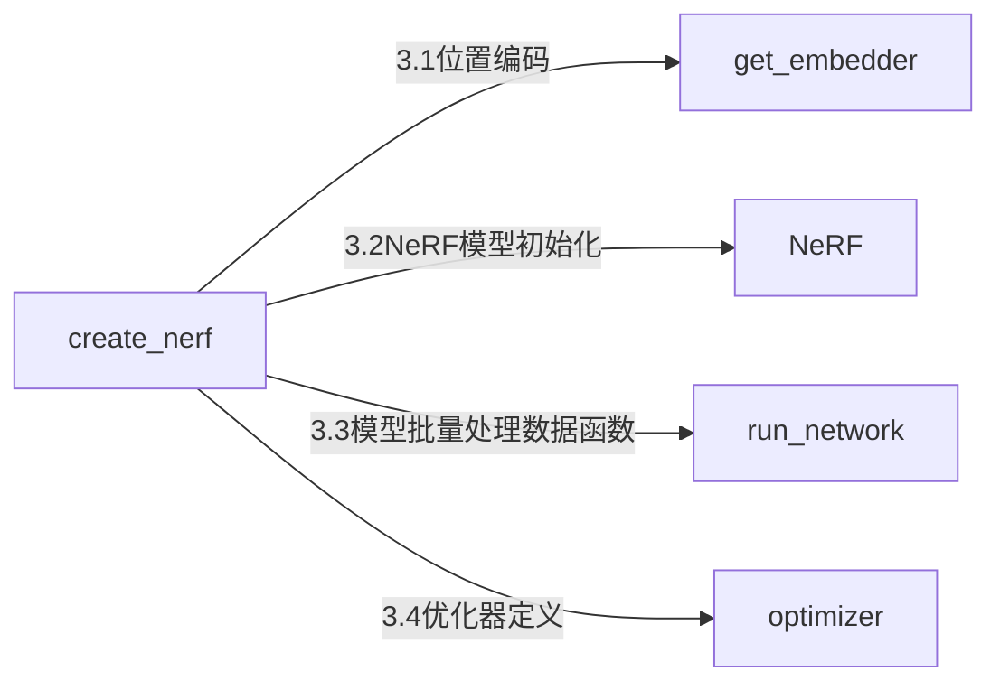
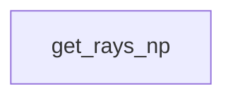
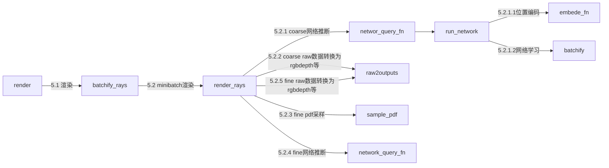

# TODO:

- 任务：构建ego-motion, object-motion和segmentation之间的约束，再根据这个约束构建Loss，最后构建一个graph去进行优化
  - ego-motion：拍摄某一张图片时相机的位姿
  - object-motion：这张图片上每个属于运动物体的像素相对于相机的位姿
  - motion-segmentation：这张图片上每个像素的分类(一个mask) 
- 图优化：
  - 节点：上面这3个优化量
  - 边：loss函数
- 要解决：
  - [ ] 怎么去构建这个图
  - [ ] 怎么建立loss/error
- 9.11-17
  - [x] debug通dytanvo
  - [ ] 提取出dyatnvo的motion segmentation部分
  - [ ] 将motion segmentation加入到co-slam中去
  - [ ] 看neural scene graphs for dynamic scenes论文（是否可以把动态物体建模成一个节点）
  - [ ] 看neural implicit dense semantic slam论文

# 问题思考：

1. **图优化是什么**

   在图优化中，问题被建模为一个图，其中节点表示要优化的变量，边表示约束。

   节点和边都有与之相关联的代价函数（即loss函数）。

   图优化的目标是通过调整节点的值来最小化或最大化代价函数，从而满足约束。

2. **g2o如何实现图优化的**

   1. 构建优化问题的图：在应用中，您需要根据特定问题的性质构建一个图结构。图中的节点表示优化变量，边表示约束，而约束的计算通常是通过计算误差（残差）来实现的。
   2. 定义代价函数：对于每个边，您需要定义一个代价函数，该函数测量当前估计值与观测值之间的误差。**代价函数的设计是问题的关键部分**。
   3. 选择优化算法：g2o支持多种优化算法，您可以根据问题的特性和要求选择合适的优化算法。一些常见的优化算法包括高斯牛顿、Levenberg-Marquardt等。
   4. 运行优化：调用g2o库的优化函数，将图结构、代价函数和优化算法传递给它。然后，g2o库将运行优化算法来最小化或最大化代价函数，并得到优化后的变量值。
   5. 获取优化结果：在优化完成后，您可以获取优化后的变量值，从而得到问题的最优解。

3. **如何将位姿等信息转为.g2o文件**

   1. 准备相机位姿数据：首先，您需要将相机位姿数据准备好，通常以某种结构化格式存储，比如文本文件或CSV文件。每个位姿可能包含帧号、位姿信息（例如，位置和姿态）、时间戳等。
   2. 创建.g2o文件：使用编程语言（例如Python）读取相机位姿数据，然后将其转换为.g2o文件格式。
   3. 写入.g2o文件：在创建.g2o文件时，您需要按照.g2o文件的格式逐行写入相机位姿数据。根据之前的示例，为每个位姿节点和边写入对应的信息。

   例子：

   ```python
   # Python script to convert camera poses to g2o file format
   
   input_file = "camera_poses.txt"
   output_file = "output.g2o"
   
   with open(input_file, 'r') as f_in, open(output_file, 'w') as f_out:
       for line in f_in:
           data = line.strip().split()
           frame_id = int(data[0])
           x, y, theta = map(float, data[1:])
           
           # Write node information to g2o file
           f_out.write(f"VERTEX_SE2 {frame_id} {x} {y} {theta}\n")
   
       # Assuming you have edge information (e.g., from odometry) connecting consecutive frames
       for i in range(1, frame_id):
           f_out.write(f"EDGE_SE2 {i-1} {i} dx dy dtheta dx_var dy_var dtheta_var\n")
   
   print("Conversion to g2o file complete.")
   
   ```

4. **可以用g2o同时优化相机位姿、目标位姿和语义分割吗**

   - 首先将相机位姿、目标位姿和语义分割信息分别作为不同类型的节点
     - 相机位姿节点：包含相机在不同帧中的位姿变量，例如，相机在帧0、帧1、帧2等的位姿。
     - 目标位姿节点：包含目标在不同帧中的位姿变量，例如，目标在帧0、帧1、帧2等的位姿。
     - 语义分割信息节点：包含不同帧中的语义分割信息，例如，每个像素的类别标签。
   - 然后添加适当的边来建立约束
     - 相机位姿与目标位姿的约束边：这些边可以基于视觉特征或运动估计建立，用于约束相机和目标在不同帧中的相对运动。
     - 目标位姿与语义分割信息的约束边：这些边可以根据目标在图像中的像素位置和语义分割信息进行建立，用于约束目标的位置和类别信息。

5. **g2o提供了哪些图优化算法**

   - **Gauss-Newton（高斯牛顿）方法**：这是一种基于局部线性化的迭代方法，用于最小化残差的平方和。每次迭代中，它在当前估计点处线性化残差项，并通过求解线性方程组来更新估计。
   - **Levenberg-Marquardt（LM）方法**：LM 方法结合了 Gauss-Newton 方法和梯度下降方法的优点，可以在迭代中动态调整步长以保证数值稳定性。它在初始阶段使用梯度下降，然后过渡到高斯牛顿方法。
   - **Dogleg 方法**：Dogleg 方法是一种在 Gauss-Newton 和 Steepest Descent 之间插值的方法，旨在平衡快速收敛和数值稳定性。
   - **Trust Region 方法**：这是一种动态调整步长的方法，它在每次迭代中确定一个“信赖区域”，并在该区域内进行搜索以找到更好的估计。
   - **Schur Complement 方法**：这是一种优化算法，通过分解雅可比矩阵为 Schur 补（Schur Complement）形式，可以加速求解。

6. **相机到世界坐标系的变换矩阵（c2w），如何判断每根光线的方向**

   1. **生成像素坐标：** 首先，生成每个像素的坐标，从左上角开始，沿着图像的行和列方向递增。
   2. **生成相机坐标：** 将生成的像素坐标映射到相机坐标系。可以通过相机的内参（内部参数）来进行坐标映射。
   3. **生成射线方向向量：** 将像素点在相机坐标系下的坐标乘以c2w变换矩阵的旋转部分来生成世界坐标系下的射线方向向量。

   > 射线的方向向量: 相机中心(0,0,0)指向相机坐标系下的像素点(x,y,z)就是射线的方向，然后乘上c2w就是世界坐标系下的射线方向。

# 0. 数据集

- [waymo](https://waymo.com/open/licensing/)

# 1. NeRF论文笔记

详细论文笔记见Zotero上pdf的笔记

## 1.1 什么是NeRF

- NeRF (Neural Radiance Fields)即神经辐射场，他用一个MLP神经网络去隐式地学习一个三维场景。
  - 输入：稀疏的多角度 且 有位姿的图像
  - 输出：神经辐射场模型（根据此模型可以渲染出任意角度下的照片）
  
- NeRF本质上是完成了3D渲染功能

  - 渲染：将场景定义（包括摄像机、灯光、表面几何和材料）转换为模拟摄像机图像的过程。

    简单来说就是模拟相机的拍照过程，生成的结果是该视角下看到的一张照片

  - 传统方法有光栅化（rasterization），光线追踪（ray tracing）

    相关课程：

    - [GAMES101 现代计算机图形学入门](https://www.bilibili.com/video/BV1X7411F744/?spm_id_from=333.337.search-card.all.click)

- 隐式表达和显式表达：

  - 隐式表达Implicit：告诉3D点满足特定的关系，而不是具体的点在哪里。
  
    例子：
  
    - 一个公式：$f(x,y,z)=0$
    - SDF
    - NeRF：用一个全连接深度网络来表示场景
  
  - 显示表达Explicit：直接给出3D点或3D点的参数映射
  
    例子：
  
    - 点云
    - 网格
    - 体素
  
- 缺点：

  - 训练和推理都很慢，但用了Tiny-cuda-nn的话就快的离谱。
  - 只能表示静态的场景
  - 对光照处理不好
  - 训练的模型都只能代表一个场景，没有泛化能力

## 1.2 NeRF原理

1. **神经辐射场网络**：输入5D坐标$(x,y,z,\theta,\phi)$到MLP训练得到颜色$C$和体密度$\sigma$. (2D->3D)

   - march camera rays through the scene to generate a sampled set of 3D points

   - use those points and their corresponding 2D viewing directions as input to the neural network to produce an output set of colors and densities

2. **体渲染**：使用体渲染技术，将颜色和体密度渲染出RGB图片. (3D->2D)

   - use classical volume rendering techniques to accumulate those colors and densities into a 2D image

## 1.3 NeRF公式

1. **神经辐射场网络**

   训练神经辐射场（NERF）网络时，通常会采用一种称为“射线采样”（Ray Sampling）的技术。在这种技术中，每张图像的每个像素点都会产生一条射线（ray），射线从相机位置穿过像素点并延伸到场景中。因此，每个射线都会对应一个五维坐标点，包括三维坐标（X、Y、Z）和方向角度（θ、φ）。

   - 公式：
     $$
     F_\theta:(\mathbf{x,d})\rightarrow(\mathbf{c},\sigma)\tag{1}
     $$
     

     - $F_\theta$: MLP(Multilayer Perceptron.)神经网络

     - $\mathbf{x}$: 场景中某一个观察点的坐标，基于相机坐标系/世界坐标系

     - $\mathbf{d}$: 相机指向这个观察点的射线方向即$(\theta,\phi)$

     - $\mathbf{c}$: 该射线上各个采样点的颜色(r,g,b)

     - $\sigma$: 该射线上各个采样点的体密度（也叫不透明度，消光系数）

       这个值表示了光线在穿过该点时的吸收程度或透明度，体密度越大越不透光，体密度为0时物体时透明的。
     
   - 神经网络实现

     1. 用8个全连层训练输入坐标X，输出不透明度$\sigma$和256维的特征向量
        - 激活函数：ReLU
        - 每层256个通道(channels)
     2. 然后用一个全连接层训练这个特征向量和相机视角，最后得到这个视角下的RGB值
        - 激活函数：ReLU
        - 每层128个通道

2. **体渲染**

   1. 参考论文：[Optical Models for Direct Volume Rendering](https://courses.cs.duke.edu/spring03/cps296.8/papers/max95opticalModelsForDirectVolumeRendering.pdf)  得到光学吸收发射模型
      $$
      C(\mathbf{r})=\displaystyle \int_{t_n}^{t_f}T(t)\sigma(\mathbf{r}(t))\mathbf{c}(\mathbf{r}(t),\mathbf{d})dt,\ where\ T(t)=exp(-\displaystyle \int_{t_n}^t\sigma(\mathbf{r}(s))ds) \tag{2}
      $$

      - $C(\mathbf{r})$：是光线r(t)处期望的颜色
      - $t_n,t_f$：是最近和最远平面深度（相机到该点的距离）
      - $T(t)$​：累积的透明度，光线$t_n$传播到$t$而不撞击任何其他粒子的概率。
      - $\sigma(\mathbf{r}(t))$：神经辐射场算出来的体积密度，也就是消光系数（不透明度）
      - $\mathbf{c}(\mathbf{r}(t),\mathbf{d})dt$：神经辐射场算出来的颜色

   2. 将近远平面等分成N份，在每份小区间内随机取样
      $$
      t_i\sim \mathcal{U}\big[t_n+\frac{i-1}{N}(t_f-t_n),t_n+\frac{i}{N}(t_f-t_n)\big] \tag{3}
      $$

   3. 通过3式得到离散取样点后，就可以将2式写成电脑可处理的离散模式，将神经辐射场从3式中采样学来的各个颜色和体密度，渲染出近似颜色
      $$
      \hat{C}(\mathbf{r})=\sum_{i=1}^NT_i(1-exp(-\sigma_i\delta_i))\mathbf{c}_i,\ where\ T_i=exp(-\sum_{j=1}^{i-1}\sigma_j\delta_j) \tag{4}
      $$

      - $\delta_i=t_{i+1}-t_i$: 最近adjacent取样之间的距离

3. **LOSS函数**
   $$
   \mathcal{L}=\sum_{\mathbf{r}\in\mathcal{R}}\big[||\hat{C}_c(\mathbf{r})-C(\mathbf{r}) ||_2^2+||\hat{C}_f(\mathbf{r})-C(\mathbf{r}) ||_2^2\big]
   $$

   - $\hat{C}_c$：corse volume predicted RGB colors for ray r
   - $C$：ground truth RGB colors for ray r
   - $\hat{C}_f$：fine volume predicted RGB colors for ray r

## 1.4NeRF的两个优化

直接将5D坐标送入MLP(Multilayer Perceptron.)学习，没法表达高分辨率的复杂场景，所以使用了2个提升措施：

### 1.4.1 Positional encoding

由于5D输入在颜色和几何的高频变换方面表现不好，所以在5D输入传递到NeRF网络之前，使用高频函数将输入映射到更高维空间可以更好地拟合包含高频变换的数据。从而使得nerf可以同时兼顾低频和高频信息。

- 什么是高频/低频信号：

  - 高频信号：表示图像中灰度值变化剧烈的区域，对应着图像的边缘（轮廓）、噪声以及细节部分
  - 低频信号：低频就是颜色缓慢地变化,也就是灰度缓慢地变化,就代表着那是连续渐变的一块区域。

- 位置编码怎么做：

  将5D坐标进行一个类似于傅里叶变换的操作，将其映射到高维空间，然后再作为MLP的输入。

  神经网络变成：$F_\theta=F'_\theta\circ\gamma$

  - $F'_\theta$：还是简单的MLP

  - $\gamma$：类似傅里叶的映射（转变成sin,cos的组合，具体公式见论文）

    在论文中：

    - 对$x,y,z$ L选择10，从而3个变量变成60个变量
    - 对$\theta,\phi$ L选择4，从而2个变量变成24个变量
    
    为什么用正弦余弦函数：
    
    - 因为可以生成周期性信号，可以捕捉到输入数据中的周期性变化

- 为什么傅里叶变换后可以学习到更多特征？见[论证论文](https://arxiv.org/abs/2006.10739)

### 1.4.2 Hierarchical volume sampling

为了解决对渲染图像没有贡献的自由空间和遮挡区域仍然被重复采样的问题，这里采用了层级采样。

但一开始我们并不知道哪些点是有用的，哪些是没用的，所以一开始粗采样，然后精细采样。

层级采样会同时优化2个NeRF网络，一个粗糙coarse，一个精细fine。

层级采样具体实现：

1. 首先根据上面3式进行$N_c$次粗采样(即采样的稀疏一点)，论文里选了64个采样点

2. 根据4式改写为下面5式
   $$
   \hat{C}_c(\mathbf{r})=\sum_{i=1}^{N_c}w_i\mathbf{c}_i,\ \ \ \ \ w_i=T_i(1-exp(-\sigma_i\delta_i)) \tag{5}
   $$

   - 由5式渲染完粗糙网络后，归一化得到一个权重值$\hat{w}_i=w_i/\sum_{j=1}^{N_c}$
   - 这个权重可以看成沿着射线的**分段-常数概率密度函数**(piecewise-constant PDF)
   - 这个权重值因为只和体密度(不透光率)$\sigma$有关，所以它告诉了我们这条射线上哪些部分是有物体的，也即我们需要渲染的东西

3. 根据上面算出的权重值进行inverse transform sampling**逆变换采样**，精细选出$N_f$个采样点，论文里选了128个点
   - 这样选出来的128个点，就会集中于我们想要渲染的目标
4. 最后使用2次采样$N_c+N_f$，即64+128个采样点的数据，来渲染出最终的颜色$\hat{C}_f(\mathbf{r})$

## 1.5 性能指标PSNR/SSIM/LPIPS

- PSNR（峰值信噪比，Peak Signal-to-Noise Ratio）
  - PSNR 最小值为 0，PSNR 越大，两张图像差异越小
- SSIM （结构相似性指数，structural similarity index）
  - SSIM 越大，两张图像越相似
- LPIPS（学习感知图像块相似度，Learned Perceptual Image Patch Similarity)
  - LPIPS的值越低，表示两张图像越相似

## 1.6 生成自己的数据集

参考1：课程

参考2：[知乎](https://zhuanlan.zhihu.com/p/576416530)

- 第一步：采集图像
  - 方法1：自己拍照
  - 方法2：使用[dtu数据集](https://roboimagedata.compute.dtu.dk/?page_id=36)，[tanks and temples数据集](https://www.tanksandtemples.org/download/)
- 第二步：位姿计算
  - 方法1：使用OpenMVG/SLAM
  - 方法2：使用colmap计算位姿
- 第三步：转换成llff数据格式

## 1.7 理解汇总

### 1.7.1 NeRF的体渲染方程

1. 在每张图上采样一些点作为观察点：
   - 观察点在相机坐标系中的位置(x,y,z)
   - 相机到观察点的射线方向$(\theta,\phi)$
2. 在这些观察点构成的射线上采样一些采样点
3. 使用神经辐射场网络预测每个采样点的体密度$\sigma$和颜色c
4. 根据光学吸收发射模型公式的离散模式，计算出观察点的颜色C

### 1.7.2 NeRF的位置编码的好处和坏处分析

好处：

- 可以更好的处理高频信息，如轮廓、细节

坏处：

- 内存消耗和计算复杂性
- 对密集采样点的不必要编码

# 2. NeRF源码笔记

[100行代码实现nerf](https://avoid.overfit.cn/post/3d89b7ed625b437993e3fde57f36c70a)

## 2.1 NeRF源码安装

- [NeRF论文](https://www.matthewtancik.com/nerf)是用TensorFlow做的：[TensorFlow版本](https://github.com/bmild/nerf)

- 使用别人写好的[Pytorch版本](https://github.com/yenchenlin/nerf-pytorch)的NeRF

  ```
  git clone https://github.com/yenchenlin/nerf-pytorch.git
  cd nerf-pytorch
  pip install -r requirements.txt
  ```

- 具体如何运行见[Pytorch版本](https://github.com/yenchenlin/nerf-pytorch)的README。

  ```shell
  # 下载数据集lego和fern,在nerf-pytorch文件夹下：
  bash download_example_data.sh
  # train a low-res lego NeRF:
  python run_nerf.py --config configs/lego.txt
  # train a low-res fern NeRF:
  python run_nerf.py --config configs/fern.txt
  ```

- 实测可运行：

  ```
  Pytorch:2.0.0
  Cuda(conda):11.8
  Cuda(系统):12.1
  Ubuntu:20.04
  ```

  

## 2.2 Instant-ngp安装

[Instant-ngp](https://github.com/NVlabs/instant-ngp)使用了[Tiny-cuda-nn](https://github.com/NVlabs/tiny-cuda-nn)5s算完NeRF,否则要算五个半小时

```
$ git clone --recursive https://github.com/nvlabs/instant-ngp
$ cd instant-ngp
$ cmake . -B build -DCMAKE_CUDA_COMPILER=/usr/local/cuda-12.1/bin/nvcc -DTCNN_CUDA_ARCHITECTURES=61
$ cmake --build build --config RelWithDebInfo -j
```

- 如何使用见git[主页](https://github.com/NVlabs/instant-ngp#usage)

- 实测可运行

  ```
  Pytorch:2.0.0
  Cuda(conda):11.8
  Cuda(系统):12.1
  Ubuntu:20.04
  CMake:3.26.3
  ```


## 2.3 代码调试

在2.1中运行代码时需要同时给入配置文件，在debug时同样需要配置一下：

1. VSCODE打开NeRF代码仓库文件夹

2. 点开`Run and Debug`，然后点`create a launch.json file`

3. 将运行命令参数输入进去

   ```json
   {
       "version": "0.2.0",
       "configurations": [
           {
               "name": "Python: Current File",
               "type": "python",
               "request": "launch",
               "program": "${file}",
               "console": "integratedTerminal",
               "justMyCode": true,
               // 比如调试fern这个数据集
               // 将命令“python run_nerf.py --config configs/fern.txt”中的参数加入到当前配置文件中
               "args": [
                   "--config","configs/fern.txt"
               ]
           }
       ]
   }
   ```

## 2.4 代码运行流程



### 2.4.1 参数设置

参数见代码的`config_parser`类，要修改训练参数/数据集/保存地址等等可以通过:

1. 直接修改类里的默认值
2. 编写configs.txt，然后运行代码时作为参数传入

### 2.4.2 数据加载



- 这里用的是llff数据格式：

  LLFF格式数据可以将对应图片参数、相机位姿和相机参数简洁有效地存储在一个npy文件中，以方便python读取，NeRF模型源码有直接对LLFF格式数据集进行训练的配置和模块`load_llff_data`。

### 2.4.3 NeRF网络构建




- 位置xyz从3维位置编码成63维的高维空间后用8层256通道神经网络去学习得到256个特征值和不透明度$\sigma$
- 方向$\theta,\varphi$从2维位置编码成27维的高维空间后和不透明度$\sigma$用一层128通道神经网络学习得到RGB值
- 在第五层，xyz的高维空间值还会传入一遍

### 2.4.4 生成光线ray数据



世界坐标系转到图像坐标系


### 2.4.5 渲染过程




# 3. lietorch 源码笔记

论文：https://arxiv.org/abs/2103.12032

## 3.1 理论概览

- **解决的问题**：

  如何计算3D变换群$SO(3),SE(3),Sim(3)$的反向传播问题

- **已有的方法**：

  计算3D transformation groups矩阵的指数和逆的雅可比（求导）

  缺点：

  1. 在传播中也会传播奇异性singularities,导致梯度爆炸gradients explode
  2. 很难在pytorch和tensorflow中通过自动微分automatic differentiation实现稳点可靠的梯度计算
  3. 对于相似变换sim(3)这种包含复杂表达式的群，计算量非常庞大

- **该论文做法**：

  保持群结构，并直接在切空间tangent space中进行反向传播

  优点：

  1. Numerical Stability: 避免了在充满奇异点的的子步骤中进行微分计算
  2. Representation Agnostic: 不关心3D变换群是如何表达的，四元数和旋转矩阵都可以直接传入计算。
  3. Reduced Computation Graphs:在反向传播中不需要保存中间值，节省计算存储空间
  4. Manifold Optimization：可以直接优化3D变换群，不用重新投影梯度。

- **什么是切空间tangent space**

  - 切空间（Tangent space）是微积分和微分几何中的一个重要概念。

    - 在数学上，切空间是在一点上的一个向量空间，用于描述在该点附近的局部性质。
    - 在几何学和物理学中，切空间通常用于描述曲面或流形上的切向量或切平面。

  - 例子：
    一个简单的切空间的例子是平面上某点的切空间。在平面上，切向量可以被描述为沿着曲线运动的速度矢量。考虑平面上一条光滑曲线，例如圆形，我们可以在曲线上的某个点P处定义一个切向量，描述沿着曲线运动的速度方向和速度大小。这个切向量位于P点处的切空间中，可以看作是一个二维向量，其中一个维度描述速度大小，另一个维度描述速度方向。

    更具体地说，对于平面上的一个点P和一条光滑曲线C，可以定义一个在P点处的切向量，表示沿着曲线C在P点处运动的速度方向和速度大小。这个切向量可以被表示为一个二维向量，其中一个维度表示速度大小，另一个维度表示速度方向。这个切向量所在的空间就是在P点处的切空间。如果考虑平面上所有点的切空间，就可以得到整个平面的切空间。

  - 和欧几里得空间Euclidean space的转换：

    欧几里得空间到切空间的转化可以通过求导数来实现。

    - 在欧几里得空间中，函数的导数描述了函数在某一点处的变化率，因此可以用于描述该点附近的局部性质。
    - 类似地，在流形上，函数的导数也可以用于描述该点附近的局部性质。

    导数可以用于描述在该点处的切空间。在深度学习中，如果我们希望在流形上进行反向传播，可以将梯度映射到切空间中，并在该空间中进行计算和处理。这样，就可以通过导数来计算在流形上的反向传播，而不必考虑流形本身的结构。

- **该论文的主要贡献：**

  1. First, we introduce a new method of auto-differentiation involving 3D transformation groups by performing backpropagation in the tangent space.
  2. Second, we introduce LieTorch, an opensource, easy-to-use PyTorch library that implements tangent space backpropagation

## 3.2 安装使用

- 环境

  ```shell
  # conda基本环境：conda install scipy pyyaml pytorch torchvision torchaudio pytorch-cuda=11.8 -c pytorch -c nvidia
  python=3.8
  cuda=11.8
  pytorch=2.0.1
  # 通过pip install opencv-python open3d
  opencv-python=4.7.0.72
  open3d=0.17.0	
  ```

- 安装

  ```shell
  # 官网subrepo了eigen，所以clone时要--recursive ,但如果本来就装了eigen就不需要
  git clone https://github.com/princeton-vl/lietorch.git
  python setup.py install
  ./run_tests.sh
  ```

     

## 3.3 pgo的例子

官网做[Pose Graph Optimization (PGO)](https://github.com/princeton-vl/lietorch/tree/master/examples/pgo)的例子。

这个例子只是根据**Riemannian Gradient Descent with a reshaping function (Tron et al. 2012)**做了位姿初始化(初始估计值)，这有助于Pgo更快的收敛到准确的解

运行：`python main.py --problem=torus3D.g2o`

调试：

```json
            "cwd": "${fileDirname}",
            "args": [
                "--problem","./g2o_files/torus3D.g2o"
            ]
```

代码：

```python
import torch
from lietorch import SO3, SE3, LieGroupParameter

import argparse
import numpy as np
import time
import torch.optim as optim
import torch.nn.functional as F


def draw(verticies):
    """ draw pose graph """
    import open3d as o3d

    n = len(verticies)
    points = np.array([x[1][:3] for x in verticies])
    lines = np.stack([np.arange(0,n-1), np.arange(1,n)], 1)

    line_set = o3d.geometry.LineSet(
        points=o3d.utility.Vector3dVector(points),
        lines=o3d.utility.Vector2iVector(lines),
    )
    o3d.visualization.draw_geometries([line_set])

def info2mat(info):
    mat = np.zeros((6,6))
    ix = 0
    for i in range(mat.shape[0]):
        mat[i,i:] = info[ix:ix+(6-i)]
        mat[i:,i] = info[ix:ix+(6-i)]
        ix += (6-i)

    return mat

def read_g2o(fn):
    verticies, edges = [], []
    # 使用with语句打开文件后，在语句块结束时会自动关闭文件，无需手动调用close()方法。
    with open(fn) as f:
        for line in f:
            line = line.split()
            if line[0] == 'VERTEX_SE3:QUAT':
                v = int(line[1])        #位姿ID
                pose = np.array(line[2:], dtype=np.float32)
                verticies.append([v, pose]) # 添加顶点

            elif line[0] == 'EDGE_SE3:QUAT':
                u = int(line[1])    #位姿1 ID
                v = int(line[2])    #位姿2 ID
                pose = np.array(line[3:10], dtype=np.float32)   # 位姿
                info = np.array(line[10:], dtype=np.float32)    # 信息矩阵

                info = info2mat(info)   # 转换成矩阵
                edges.append([u, v, pose, info, line])  # 添加边

    return verticies, edges

def write_g2o(pose_graph, fn):
    import csv
    verticies, edges = pose_graph
    with open(fn, 'w') as f:
        writer = csv.writer(f, delimiter=' ')
        for (v, pose) in verticies:
            row = ['VERTEX_SE3:QUAT', v] + pose.tolist()
            writer.writerow(row)
        for edge in edges:
            writer.writerow(edge[-1])

def reshaping_fn(dE, b=1.5):
    """ Reshaping function from "Intrinsic consensus on SO(3), Tron et al."""
    ang = dE.log().norm(dim=-1)
    err = 1/b - (1/b + ang) * torch.exp(-b*ang)
    return err.sum()

def gradient_initializer(pose_graph, n_steps=500, lr_init=0.2):
    """ Riemannian Gradient Descent 黎曼梯度下降
    Pose Graph Optimization 是一个在非欧几里德空间（即刚体运动群、李群等）中进行的优化问题，因此传统的梯度下降等方法在这种情况下可能不太适用。
    而 Riemannian Gradient Descent 可以在流形上考虑特殊的几何结构和度量，从而更好地适应这种问题。

    初始化，即对位姿的初始估计，对于优化的收敛性和性能影响很大，因此一个合适的初始估计是至关重要的。
    使用 Riemannian Gradient Descent 来进行初始化的过程可以按照以下步骤进行:
        1. 选择初始点和初始估计：首先，选择一个合适的初始点，它可以是任意合法的位姿组合。然后，将这个初始点映射到流形中，得到初始估计。
        2. Riemannian Gradient Descent: 在流形上应用 Riemannian Gradient Descent,利用流形上的切向量和度量来计算梯度和更新。这会在流形上逐步迭代优化初始估计。
        3. 反映射回位姿空间：一旦在流形上获得了一个较好的优化结果，可以使用逆映射将优化后的结果映射回位姿空间，得到一个更好的初始估计。
        4. 进一步优化：在得到了更好的初始估计之后，可以将这个估计作为 Pose Graph Optimization 的初始点，然后使用传统的优化方法（如非线性最小二乘）进行进一步优化。

    """

    verticies, edges = pose_graph

    # edge indicies (ii, jj)
    ii = np.array([x[0] for x in edges])    # 列表推导式，获得边的第一个顶点的id
    jj = np.array([x[1] for x in edges])    # 列表推导式，获得边的第二个顶点的id
    ii = torch.from_numpy(ii).cuda()        # 将numpy的array转为torch的tensor类型，并将其移动到Gpu上去
    jj = torch.from_numpy(jj).cuda()

    Eij = np.stack([x[2][3:] for x in edges])   # 将所有边的2顶点的位姿(平移+四元数)合并为1个数组
    Eij = SO3(torch.from_numpy(Eij).float().cuda()) # 先转为tensor，再创建SO(3)类

    R = np.stack([x[1][3:] for x in verticies]) # x[0]id,x[1]7个值取后面4个四元数构建旋转矩阵
    R = SO3(torch.from_numpy(R).float().cuda())
    R = LieGroupParameter(R)

    # use gradient descent with momentum
    optimizer = optim.SGD([R], lr=lr_init, momentum=0.5)    # 定义torch的随机梯度下降sgd优化器

    start = time.time()
    for i in range(n_steps):
        optimizer.zero_grad()   # 将模型参数的梯度置零，以准备接收新的梯度。

        for param_group in optimizer.param_groups:
            param_group['lr'] = lr_init * .995**i

        # rotation error
        dE = (R[ii].inv() * R[jj]) * Eij.inv()
        loss = reshaping_fn(dE)

        loss.backward()     # 根据损失值计算参数的梯度
        optimizer.step()    # 根据梯度更新模型的参数

        if i%25 == 0:
            print(i, lr_init * .995**i, loss.item())

    # convert rotations to pose3 从流形SO(3):旋转矩阵 再转为 欧几里德空间SE(3)：李代数(位姿)
    quats = R.group.data.detach().cpu().numpy()

    for i in range(len(verticies)):
        verticies[i][1][3:] = quats[i]

    return verticies, edges


if __name__ == '__main__':
    parser = argparse.ArgumentParser()
    parser.add_argument('--problem', help="input pose graph optimization file (.g2o format)")
    args = parser.parse_args()

    # 从.g2o文件中读取边和顶点
    output_path = args.problem.replace('.g2o', '_rotavg.g2o')   # problem是上面的参数名，replace()函数是argparse库的
    input_pose_graph = read_g2o(args.problem)                   # args.problem：保存的是.g2o的地址。返回所有的顶点和边
    # 优化点和边
    rot_pose_graph = gradient_initializer(input_pose_graph)     # 返回优化好后的顶点和边
    write_g2o(rot_pose_graph, output_path)


```


# 4. f2-NERF笔记

[git](https://github.com/Fernweh-yang/CodeComments_f2-nerf)

## 4.1 f2-nerf安装

直接照着[git readme](https://github.com/totoro97/f2-nerf)的运行

在以下环境可行:

```
ubuntu 20 
Cuda:12.1
Ubuntu:20.04
CMake:3.26.3
```

## 4.2 f2-nerf使用


# 5. DytanVO

[git](https://github.com/castacks/DytanVO)

They built DytanVO on top of [TartanVO](https://github.com/castacks/tartanvo). They implemented the segmentation network by adapting [rigidmask](https://github.com/gengshan-y/rigidmask). 

## 5.1 安装

1. 从git下载源码

   ```
   git clone git@github.com:castacks/DytanVO.git
   ```

2. 修改源代码包中的environment.yml文件

   ```yaml
   把-pip:都注释掉
     # - pip:
     #   - absl-py==0.11.0
     #   - antlr4-python3-runtime==4.9.3
     #   - appdirs==1.4.4
     #   - beautifulsoup4==4.11.1
     #   - black==21.4b2
     #   - cachetools==4.1.1
   ```

   - 创建conda环境

     ```
     conda env create -f environment.yml
     conda activate dytanvo
     ```

3. 编译[DCNv2](https://github.com/MatthewHowe/DCNv2)

   ```
   cd Network/rigidmask/networks/DCNv2/; 
   python setup.py install; 
   cd -
   ```

   - 这时候会报各种库缺失，就用`pip install xxx`去下载他们

     版本参见上面注释掉的environment.yml:

     ```
     cupy-cuda102==11.1.0
     dataclasses==0.6
     dcnv2==0.1
     fastrlock==0.8
     future==0.18.2
     numpy==1.23.2
     opencv-python==4.4.0.46
     timm==0.6.7
     ```

   - test

     ```shell
     conda install pytorch torchvision torchaudio pytorch-cuda=11.7 -c pytorch -c nvidia  
     conda install scipy		# 各种数值计算的库，基于numpy
     
     # pip
     pip install opencv-python
     pip install dataclasses	 # 用于定义数据类
     python -m pip install -U matplotlib	# 可视化数据
     pip install cupy-cuda11x # 类似于gpu版本的numpy。用于数值计算。版本和cuda一致
     pip install kornia[x]	 # 基于pytorch的计算机视觉库。opencv只支持numpy
     ```
     

4. 下载[训练好的模型](https://drive.google.com/file/d/1ujYmKv5FHXYe1KETabTnSs-R2OE0KJV3/view)，并放到`models`文件夹

5. 下载数据集并解压到`data`文件夹

   - [KITTI dynamic sequences](https://drive.google.com/file/d/1BDnraRWzNf938UsfprWIkcqCSfOUyGt9/view)
   - [tartanair-shibuya](https://github.com/haleqiu/tartanair-shibuya) 
   - [Scene Flow datasets](https://lmb.informatik.uni-freiburg.de/resources/datasets/SceneFlowDatasets.en.html)

   文件夹结构为：

   ```
   ├── data
       ├── AirDOS_shibuya
           ├── RoadCrossing03
               ├── image_0
               ├── ...
               ├── gt_pose.txt
           ├── RoadCrossing04
           ├── ...
       ├── DynaKITTI
           ├── 00_1
               ├── image_2
               ├── ...
               ├── pose_left.txt
               ├── calib.txt
           ├── 01_0
           ├── ...
       ├── SceneFlow
           ├── FlyThings3D
               ├── frames_cleanpass
               ├── frames_finalpass
               ├── optical_flow
               ├── camera_data
           ├── Driving
           ├── Monkaa
       ├── ...
   ```

6. 测试

   - 除了下面还有一些参数可修改

     Add `--save-flow` tag to save intermediate optical flow outputs into the `results` folder.

     Adjust the batch size and the worker number by `--batch-size 10`, `--worker-num 5`.

   - 创建文件夹保存结果

     ```
     mkdir results
     ```

   - 对于Kitti数据

     ```shell
     # 将 traj=00_1 单独放在一行，可以使命令行更加清晰和易于修改。
     traj=00_1
     python -W ignore::UserWarning vo_trajectory_from_folder.py --vo-model-name vonet.pkl --seg-model-name segnet-kitti.pth --kitti --kitti-intrinsics-file data/DynaKITTI/$traj/calib.txt --test-dir data/DynaKITTI/$traj/image_2 --pose-file data/DynaKITTI/$traj/pose_left.txt 
     ```

   - 对于Shibuya数据

     ```shell
     traj=RoadCrossing03
     python -W ignore::UserWarning vo_trajectory_from_folder.py --flow-model-name flownet.pkl  \
     							   --pose-model-name posenet.pkl  \
     							   --seg-model segnet-sf.pth  \
     							   --airdos  \
     							   --test-dir data/AirDOS_shibuya/$traj/image_0  \
     							   --pose-file data/AirDOS_shibuya/$traj/gt_pose.txt 
     ```

   - 对于scene flow数据

     ```shell
     img=Driving/frames_finalpass/15mm_focallength/scene_forwards/fast/left
     pose=Driving/camera_data/15mm_focallength/scene_forwards/fast/camera_data.txt
     python -W ignore::UserWarning vo_trajectory_from_folder.py --flow-model-name flownet.pkl  \
     							   --pose-model-name posenet.pkl  \
     							   --seg-model segnet-sf.pth  \
     							   --sceneflow  \
     							   --test-dir data/SceneFlow/$img  \
     							   --pose-file data/SceneFlow/$pose
     ```

# 6. Theseus笔记

## 6.0 教程

- [官方tutorial](https://github.com/facebookresearch/theseus/tree/main/tutorials)
- [git](https://github.com/facebookresearch/theseus)

## 6.1 安装

Facebook开发的，下面的几个库也都是fb的。用于在pytorch中设立非线性优化层，来解决非线性优化问题

可以解决：

- [Linear solvers](https://github.com/facebookresearch/theseus/tree/main/theseus/optimizer/linear)
  - Gauss-Newton, Levenberg–Marquardt
- [Linear solvers](https://github.com/facebookresearch/theseus/tree/main/theseus/optimizer/linear)
  - Dense: Cholesky, LU; Sparse: CHOLMOD, LU (GPU-only), [BaSpaCho](https://github.com/facebookresearch/baspacho)
- [Commonly used costs](https://github.com/facebookresearch/theseus/tree/main/theseus/embodied), [AutoDiffCostFunction](https://github.com/facebookresearch/theseus/blob/main/theseus/core/cost_function.py), [RobustCostFunction](https://github.com/facebookresearch/theseus/blob/main/theseus/core/robust_cost_function.py)
- [Lie groups](https://github.com/facebookresearch/theseus/tree/main/theseus/geometry)
- [Robot kinematics](https://github.com/facebookresearch/theseus/blob/main/theseus/embodied/kinematics/kinematics_model.py)

### 1. Dispenso库安装

[dispebnso](https://github.com/facebookincubator/dispenso)是一个c++的多线程库

#### 1.1 源码安装

```cmake
#从git上release下载最新版本
mkdir build && cd build
cmake ..
make -j
sudo make install
```

### 2. OpenBLAS

[OpenBLAS](https://github.com/xianyi/OpenBLAS)是一个优化过的BLAS库(Basic Linear Algebra Subprograms) 

#### 2.1 源码安装

```shell
git clone git@github.com:xianyi/OpenBLAS.git
cd OpenBLAS
mkdir build && cd build 
cmake ..
make
sudo make install
```

### 3. BaSpaCho库安装

[BaSpaCho(**Ba**tched **Spa**rse **Cho**lesky) ](https://github.com/facebookresearch/baspacho)是一个对称正定稀疏矩阵求解器

#### 3.1 源码安装

```shell
git clone git@github.com:facebookresearch/baspacho.git
cd baspacho
mkdir build && cd build
cmake .. -DCMAKE_BUILD_TYPE=Release -DCMAKE_CUDA_COMPILER=/usr/local/cuda/bin/nvcc -DBLA_STATIC=ON -DBUILD_SHARED_LIBS=OFF
make -j16
ctest # 测试是否安装成功
sudo make install
```

### 4. Theseus源码安装

```
git clone https://github.com/facebookresearch/theseus.git && cd theseus
BASPACHO_ROOT_DIR=/home/yang/3rdLibrary/baspacho pip install -e .
```

### 5. 其他一些库

```
```


## 6.2 测试

- 环境：

  ```
  python=3.8
  cuda=11.8
  pytorch=2.0.1
  
  opencv-python=4.7.0.72
  open3d=0.17.0	
  ```

- 测试

  ```
  python -m pytest tests
  ```

  - -m：表示运行一个模块作为脚本
  - pytest：流行的python测试脚本
    - 会运行tests文件夹下所有**test_**开头或**_test**结尾的Python文件
    - 并在其中寻找**test_**开头的函数作为测试用例
